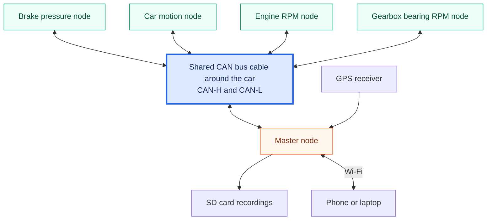

# Baja DAQ

This repository contains the firmware for McGill Baja Racing's **DAQ 3.0** data acquisition system. Data acquisition means measuring what the vehicle is doing and saving those measurements so the team can investigate performance and diagnose problems.

Small computers called **sensor nodes** measure brake pressure, car motion, engine speed, and the speed of a bearing inside the gearbox. A **master node** collects their readings, adds GPS data, and saves recording sessions to an SD card. A phone or laptop can connect to the master's Wi-Fi network to control recording, view live graphs, and download data.

The gearbox bearing measurement is a raw rotation reading. It is converted later, using the drivetrain ratios, to calculate wheel RPM and secondary RPM; the recorded value itself is not either of those speeds.

## How the boards communicate

A shared **CAN bus** cable runs around the car. Each sensor node and the master connect to that same cable to exchange messages. Physically, its data connection uses two wires, CAN-H and CAN-L, shown as one shared connection below.

The master also communicates with a phone or laptop over Wi-Fi. On the bench, simulators generate test signals for sensor-node inputs.

CAN stands for **Controller Area Network**. It lets the boards exchange short messages over the shared cable. All connected nodes can receive a message, and each handles the messages relevant to its role.

The sensor nodes use **ESP32-C3** microcontrollers, and the master uses an **ESP32-P4** with an **ESP32-C6** providing Wi-Fi. A microcontroller is a small computer built into hardware. The [sensor introduction](sensor-node/README.md) and [master introduction](master-node/README.md) explain their roles in more detail.

## Start here

You do not need a board or embedded programming experience to begin.

1. Follow [Getting started](docs/GETTING_STARTED.md) to learn the vocabulary, install tools, and build firmware without hardware.
2. Read [Contributing](CONTRIBUTING.md) to choose a first task and prepare a pull request.
3. Open the component README for your task, then its source guide for implementation details.

Read the [system overview](docs/SYSTEM_OVERVIEW.md) if you want a guided explanation of how a recording works. The [documentation index and glossary](docs/README.md) help you find a specific topic.

## Repository map

| Folder | What it contains | Start reading |
|---|---|---|
| `master-node/` | ESP32-P4 firmware: recording, GPS, SD storage, browser interface | [Master introduction](master-node/README.md) |
| `sensor-node/` | ESP32-C3 firmware: sensor measurements and communication | [Sensor introduction](sensor-node/README.md) |
| `simulators/` | ESP32-C3 bench firmware generating test signals for RPM inputs | [Simulator introduction](simulators/README.md) |
| `docs/` | Shared learning guides, procedures, and specifications | [Find a guide](docs/README.md) |

Each firmware project has its own PlatformIO configuration. The workspace file [baja-daq.code-workspace](baja-daq.code-workspace) opens them together in VS Code. **Firmware** is the program that runs on a microcontroller, a small computer built into hardware.

This documentation describes DAQ 3.0. Older V1/V2 firmware is kept on the `archive/v1-v2` branch.
